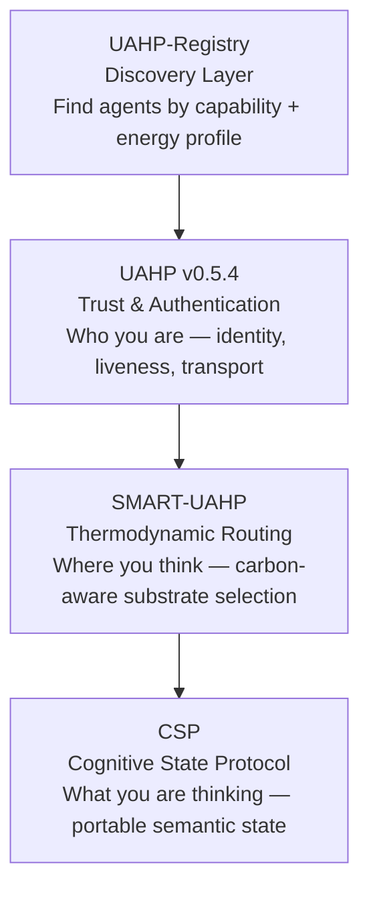

## The UAHP Agentic Stack

Four layers. One complete infrastructure for the agentic web.

| Layer | Repo | Role |
|-------|------|------|
| Discovery | UAHP-Registry | Find agents by capability and energy profile |
| Trust | UAHP v0.5.4 | Identity, liveness proofs, signed handshakes |
| Routing | SMART-UAHP | Carbon-aware substrate selection |
| State | CSP | Portable semantic state transfer |

# Universal-Agent-Handshake-Protocol
UAHP v0.5.4: Solving the "Silent Agent" Problem with Death Certificates and Liveness Proofs

Universal Agent Handshake Protocol (UAHP) v0.5.4
The Open Handshake: A Manifesto for the Agentic Age
As we move into an era where AI agents handle our schedules, our finances, and our digital lives, we face a choice. Do we route our most private intents through centralized "black box" switchboards? Or do we build a world where agents can collaborate securely, without a middleman taking a cut of our privacy?

UAHP is a public utility; a free, open-source protocol that allows any AI to shake hands and work together safely.

Core Features

-Zero-Knowledge Routing: Uses X25519 ephemeral keys so the registry routes tasks without being able to read the data.

-Liveness Proofs: Solves the "Ghosting" problem with signed heartbeats and automated suspension.

-The "Sybil" Tax: Makes fraud expensive through Sponsorship Certificates and exponential penalties.

-Cryptographic Agility: Built-in support for multiple algorithms to ensure the protocol is future-proof.
